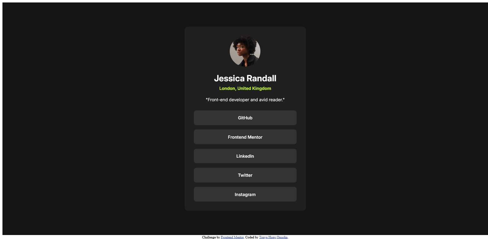

# Frontend Mentor - Social links profile solution

This is a solution to the
[Social links profile challenge on Frontend Mentor](https://www.frontendmentor.io/challenges/social-links-profile-UG32l9m6dQ).
Frontend Mentor challenges help you improve your coding skills by building realistic projects.

## Table of contents

-   [Overview](#overview)
    -   [Screenshot](#screenshot)
    -   [Links](#links)
-   [My process](#my-process)
    -   [Built with](#built-with)
    -   [Useful resources](#useful-resources)
-   [Author](#author)

## Overview

This is a simple HTML and CSS project in which the main objective is to build out a Social links profile web page.

### Screenshot

### Links

-   Live Site URL: [Vercel](https://social-links-profile-dusky-three.vercel.app/)

## My process

The process was very straightforward. I started by writing out the stucture of my HTML. I then created a CSS stylesheet
and broke down the styling of elements one piece at a time.

### Built with

-   Semantic HTML5 markup
-   CSS custom properties
-   Flexbox

### Useful resources

-   [W3Schools](https://www.w3schools.com/)

## Author

-   Email Address - [tonyeonuoha@gmail.com](tonyeonuoha@gmail.com)
